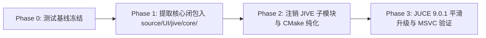

# ADR-014: 内化 Devpiano 声明式 UI 基础设施与 JIVE 子模块退役治理

## 状态

**已完全实施 (Accepted & Implemented)**（已于 Phase 27 全面实施闭环：JIVE 外部子模块彻底退役移除，最小核心闭包与 CSS Grid 完全内生入 `source/UI/jive/core/`，JUCE 9.0.1 升级及三端自动化门禁已 100% 验收合入 `main` 主干；替代并废止 ADR-008）。

---

## 背景

在 ADR-008 中，devpiano 引入了第三方 JIVE 声明式 UI 框架（Git 子模块 `submodules/JIVE`）作为界面排版引擎，成功消除了传统 JUCE 手写绝对像素坐标的繁琐问题。

然而，随着工程向 **JUCE 9.0.1 演进、代码体量收敛与跨平台构建长期可维护性** 推进，原有的外部 JIVE 子模块依赖暴露出显著的架构与治理瓶颈：

1. **实际使用面高度收敛 vs 引入包袱过重**：
   - 经源码级审计，devpiano 仅使用了 JIVE 的 5 个顶层核心概念（`Interpreter`、`GuiItem`、`Object`、`FlexContainer`、`ComponentFactory`），构建上早已完全排除 `jive_components`。
   - JIVE 仓库总计 24,591 行代码，当前引入构建的模块代码超 20,000 行，其中 **>75% 为项目从未使用的冗余抽象**（如未用的 Grid、XML 解释器、内置未用 Widget 装饰器、文件轮询监听器及性能脚手架）。
2. **上游断代（JIVE v2）不兼容且不可用**：
   - JIVE 上游存在独立的 `origin/v2` 重构分支（241 个文件变更、+14,517 / -8,572 行），彻底破坏了原有模块结构、选择器机制与属性映射。直接升级至 v2 将导致 devpiano 既有的 `StyleCatalog` 与 Accessors 全面崩溃。
3. **JUCE 9.0.1 升级阻断**：
   - JUCE 9 在 UI 层引入重大破坏性变更（`Drawable` 剥离 `Component` 继承链、`Font` 字符串宽度与度量 API 弃用、SVG 解析基于 `lunasvg` 重构）。
   - JIVE 内部代码深度触发上述编译错误。若继续保持外部 Git Submodule 形式，开发团队将无法在自身代码库内直接修补适配，导致 JUCE 大版本升级陷入死锁。
4. **Devpiano 已内生了成熟的自研 UI 基础设施**：
   - 项目在 `source/UI/jive/` 下已自主研发了 `DesignTokens`、`StyleCatalog`（含对象复用缓存与 `@token` 解析）、纯 C++ 强类型声明式 `LayoutModel` DSL、`JiveModalDialog` 通用弹窗与 `JiveUtils` 生命周期看门狗。devpiano 所需的声明式 UI 能力已在本地形成事实闭包。

---

## 对 ADR-008 的关系与裁决（ADR-008 是否应当“废止”？）

**结论：ADR-008 正式标记为「已由 ADR-014 替代并废止（Superseded by ADR-014）」**。

### 详细对比与废止原因分析：

| 维度 | ADR-008 原决策 | ADR-014 演进决策 | 关系与裁决理由 |
| :--- | :--- | :--- | :--- |
| **依赖组织方式** | 依赖外部 `submodules/JIVE` Git 子模块 | **彻底退役 JIVE 子模块**，源码级内化最小闭包至 `source/UI/jive/core/` | **废止** ADR-008 的外部子模块管理方式 |
| **代码范式与 DSL** | 依赖外部通用框架，混合 JSON 布局与解释器 | **全面转向纯 C++ 强类型 DSL** (`LayoutModel.h`)，剔除 XML/外部文件解释 | **废止** ADR-008 中通用的外部框架解释假定 |
| **声明式 UI 核心思想** | `ValueTree` 描述结构 + Flexbox 布局引擎 | **完整继承并保留** `ValueTree` 声明式 + Flex 响应式排版 | **继承** 核心设计哲学，消除手写坐标 |
| **Native 组件混合架构** | 通过工厂机制注入原生高频自绘组件 | **完整继承并固化** `ComponentFactory` 规范 | **继承** 原生自绘组件与声明式骨架的解耦边界 |
| **设计系统与样式表** | `DesignTokens` + `StyleCatalog` 单一真相源 | **完整继承并深化**，自主管理样式对象缓存与生命周期 | **继承** 并内生化为项目的核心设计资产 |

---

## 决策

1. **注销并移除 `submodules/JIVE` Git 子模块**：
   - 彻底摆脱对外部 JIVE 仓库分支迭代的被动依赖，终结上游架构断代与破坏性变更风险。
2. **提取最小必要依赖闭包，内化为 `devpiano::ui` 核心基础设施**：
   - 将 JIVE main 分支中经过严密调用链验证的 **最小闭包代码（约 3,800 行）** 精准提取至 `source/UI/jive/core/`，作为项目内生源码统一维护。
   - **保留并内化的核心资产（KEEP & CORE）**：
     - Core 核心：`Interpreter`、`GuiItem`、`GuiItemDecorator`、`CommonGuiItem`、`Property`、`Object`、`ComponentFactory`、`Event`、`Timer`。
     - Layout 核心：`BoxModel`、`Geometry`、`FlexContainer`、`FlexItem`、`GridContainer`、`GridItem`、`LayoutStrategy`、`Overflow`。
     - 核心控件包装：`Button`、`ComboBox`、`Slider`、`ProgressBar`、`Label`、`TextComponent`、`Text`、`View`。
     - 样式与画布：`StyleSheet`（精简版）、`Colours`、`Fill`、`Shadow`、`BackgroundCanvas`、`Canvas`、`Transitions`、`Transition`、`Easing`。
     - 类型转换：`FlexVariantConverters`、`GridVariantConverters`、`AttributedStringVariantConverters`、`MiscVariantConverters`。
3. **针对未使用能力实施战略分级治理与 CSS Grid 核心归位**：
   - **CSS Grid 核心升格**：经实测，`SettingsLayoutModel.cpp` 的 16 通道跟音设置面板依赖 CSS Grid 声明式布局（`display: "grid"`），因此 `GridContainer`、`GridItem` 与 `GridVariantConverters` 已正式升格为第一等核心组件纳入 `source/UI/jive/core/` 并全局启用宏 `JIVE_ENABLE_GRID=1`，由 `SettingsLayoutModelTest.cpp` 全量测试守护。
   - **精简重构（SIMPLIFY）**：
     - `Text` / `TextComponent`：剥离富文本排版冗余，重构字体测量以适配 JUCE 9。
     - `FontUtilities`：全量收敛至 `juce::FontOptions`。
     - `StyleSelector`：保持极简的 ID 与基础伪类匹配，杜绝 v2 复杂的 AST 选择器树。
     - `Drawable` 包装：适配 JUCE 9 `juce::DrawableComponent` 包装规范。
   - **坚决剔除（REMOVE，>15,000 LOC）**：
     - 剔除未用控件：`Knob`、`Spinner`、`Hyperlink`、`ImageComponent`、JIVE 原生 `Window` 与 `PluginEditor`。
     - 剔除冗余系统：`XMLParser`、`FileObserver`（项目已有 `StyleBootstrap`）、JIVE 原生 `LookAndFeel`、`Bezier` 算法库。
     - 剔除诊断脚手架：`Melatonin Perfetto`、`IndentedLogger`、`StringStreams`、`ConsoleProgressBar`。
4. **恪守开源许可证合规（MIT License）**：
   - 提取入 `source/UI/jive/core/` 的所有源文件头部完整保留原作者（James Johnson）版权声明与 MIT 许可。
   - 在项目根目录维护 `THIRD-PARTY-NOTICES.md`，如实载明原始出处与版本快照（Commit `89d5787`）。
---

## 实施路径（路线 B：先提后升）

1. **Phase 0（基线冻结）**：[已完成] 在当前 JUCE 8.0.15 环境下确保 `./scripts/dev.sh test` 100% 绿灯。
2. **Phase 1（闭包提取与内化）**：[已完成] 搬迁核心源码入 `source/UI/jive/core/`，调整命名空间与依赖，通过全量单元测试与编译。
3. **Phase 2（子模块退役）**：[已完成] 执行 `git submodule deinit -f submodules/JIVE`，清理 `.gitmodules` 与 `CMakeLists.txt`，物理删除 `submodules/JIVE`。
4. **Phase 3（JUCE 9 升级与代码质量治理）**：[已完成] 切换并锁定 JUCE 9.0.1 发布版（`e18f7f5`），完成 `FontOptions`、`GlyphArrangement` 与 `DrawableComponent` 适配；对内化代码执行 C++20 现代化（`override`、`noexcept`、`const-ref`）并完全纳入 CI `clang-tidy` 严苛门禁。
5. **Phase 4（全系统回归与发布闭环）**：[已完成] 完成全系统测试（12,668+ 断言）、双端双配置（Debug/Release）构建验证、Windows 分发包打包以及 GitHub Actions 五大自动化门禁验证，成功合入 `main` 主干。
---

## 原因

1. **极限代码瘦身与架构纯粹性**：剔除 1.6 万行无用代码与死代码，消除外部黑盒。
2. **扫清 JUCE 9.0.1 升级障碍**：所有 UI 运行时代码完全内生，使大版本编译器与 API 迁移在项目内部闭环解决。
3. **长期可维护性与产品特化**：坚决拒绝“通用 UI Framework”的过度设计陷阱，为 devpiano 打造专属、极速、零冗余的 Declarative UI 基础设施。
4. **保留未来高概率扩展期权**：通过 KEEP-LATER 策略，确保未来构建复杂预设网格或动效时无需重新造轮子。

---

## 实施复盘与最终成效 (Post-Implementation Review)

1. **彻底摆脱外部 Git Submodule 迭代枷锁**：项目外部子模块仅剩 `submodules/JUCE`（固定于 JUCE 9.0.1 官方发布标签），`.gitmodules` 与构建依赖纯净透明。
2. **代码资产规模极致精简**：从 JIVE 原上游 >24,000 行冗余实现收敛为 4,000 余行的高内聚内生源码，构建时间显著优化，消灭了一切未用黑盒抽象。
3. **JUCE 9 演进阻力归零**：所有 UI 运行时代码作为普通项目源文件直接维护，未来跟随 JUCE 大版本演进拥有 100% 敏捷适配与自主演进能力。
4. **统一的代码质量与 CI 门禁治理**：内化后的 UI 代码正式解除静态分析豁免，与核心业务代码享有同等规格的 C++20 规范与 Clang-Tidy 零警告把关。
5. **ADR-008 正式废止**，由本文档接替成为 UI 基础设施层面的唯一权威架构决策依据。
